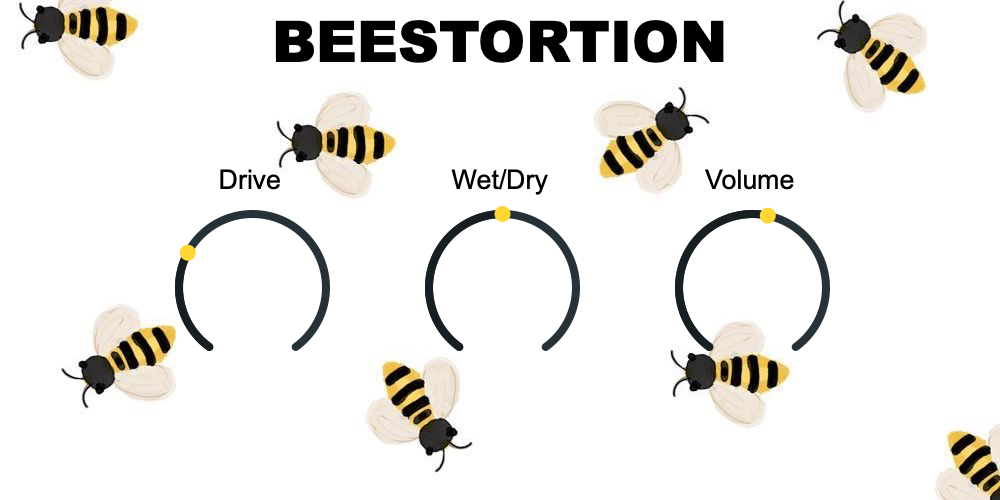

# Beestortion
A simple distortion plugin written in C++ using the JUCE framework.

Pleasurable overtones to be used softly on melody instruments, vocals, and piano, as well as a harder distortion to be used for guitar. VST3 and AU format.

